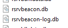
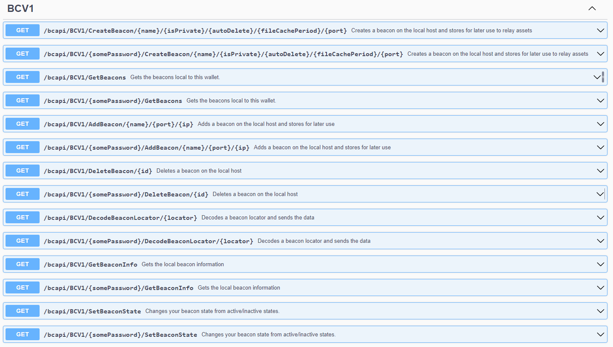

# RBX Beacons

## Summary

The purpose of this document is to teach you how to create a beacon from within the RBX CLI. Please note with this process you are never needed to expose your private key to the wallet or anywhere outside your own building application.

If you have any issues please reach out to the community through discord or your respective telegram channels.

- #### [Discord](https://discord.com/invite/PnS2HRETDh)

- #### [Website](https://www.reserveblock.io/)

- #### [Explorer](https://rbx.network/)

Creating a beacon is a rather easy process and by the end of this document you will have all the necessary information to become your own beacon.

## First off, what is a beacon?

A beacon is the underlying tool in the RBX network that is used to help relay the media associated with an NFT. NFTs when it comes to media must adhere to these rules:

1. The file may only be up to 150 MB
2. You may only have 26 assets total plus the main asset.
3. Your file extension type must not be on the ignore list of both the sender, beacon, and the receiver. (This is to help prevent the spread of malicious files)

Should an NFT not follow these rules, your beacon will reject the media and that media will not associate to the NFT on your beacon.

## What are beacon states?

A beacon has 3 states:

1. Off or not setup
   - The beacon is not running and will not accept or relay files.
2. On (Public)
   - This means your beacon is running and will accept incoming NFT assets from anyone attempting to relay.
3. On (Private)
   - A private beacon is a beacon in which only you may relay NFTs from.
   - Wallets you send your NFTs to will be able to call your beacon to receive the files, but cannot send files for the beacon to relay.

## Can I add other beacons?

Yes. You can add an infinite amount of public beacons for your wallet to choose from. Beacons are generally selected by user input, and then by region.

## Do I have to have a beacon to send NFT assets?

The network has plenty of public beacons your node will choose from should you not enter any beacons or host your own beacon.

This means that you can use the wallet in default settings and will be able to transmit NFT assets to other users.

## How does my wallet know what beacon to call?

The transaction is populated with what's called a Locator. This locator when disseminated will reveal the beacon that has the data at which point you can call out to retrieve it. The address must send a signature to verify they are the receiver before a beacon will begin the relay.

## How do I set up a beacon?

Below you find the steps to set up a beacon.

To start the beacon creation process please type /beacon and press enter in the CLI.

1. <ins>Please give your beacon a name</ins>

   - This is the local name you will give your beacon.

2. <ins>Do you want to auto delete file cache after receiver downloads? (y for yes and n for no)</ins>

   - This setting will determine if your beacon deletes the file cache once a file is successfully transmitted.

3. <ins>Do you want this beacon to be private meaning only you can upload to it? (y for yes and n for no)</ins>

   - If you select yes then only you will be able to use your beacon to relay NFT assets.

4. <ins>Do you want to cache files for a limited time? Please input a number. (0 is infinite, 5 is 5 days, 10 is 10 days, etc.)</ins>

   - This is the amount of days you are willing to store NFT assets in your data cache before releasing them and the sending of the NFT will have had to add a backup URL or will need to send files to the receiver where they can associate to the wallet.

If this process is done correctly at the end you will see “Beacon Inserted. Please restart wallet for beacon to activate.”. As stated a restart of the wallet is needed for the beacon to activate fully. This is because the beacon relayer must be rooted into the software at startup and from now on will always run at startup.

## Can I disable my own beacon?

Yes. Please type the command `/switchbeacon` and press enter. This will turn your local beacon on and off.

## Do any ports need to be opened and forwarded?

Yes. For a beacon to operate you will want to ensure the following ports are both open, and forwarded to the machine.

Ports:

- <ins>3338</ins>
- <ins>23338</ins>

You can easily check this by going to any online port checker, typing in your IP, and then the port with the wallet running after a beacon setup and restart. If the port shows open then your beacon is running. If it does not that means one of 3 problems:

1. The port is blocked on the local firewall of the machine and needs to be opened.
2. The port is not forwarded through the router, switch, or any other network device the wallet hosted machine sits on.
3. The beacon is not on and running.

## How can I tell if my beacon is running?

1. Perform a port check with an online tool to ensure the ports are open.
2. Type /beacon and press enter. If your beacon is running and setup it will print out the beacon's information. If it isn’t it will have you run the setup process again.

If you feel at any point you have messed up your beacon, other added beacons, or the network public beacons and want to start over you can simply delete the two beacon files. A screenshot is provided below.  
  
There is also a complete API to support the beacons where you can easily integrate and perform more complex tasks. You can see this at `http://localhost:7292/swagger`

## How do I get help if needed?

If any of the above instructions are not working or if you are having issues it is recommended to reach out to the community discord. There are numerous devs and community members who would be happy to help. Link is above on the first page.
