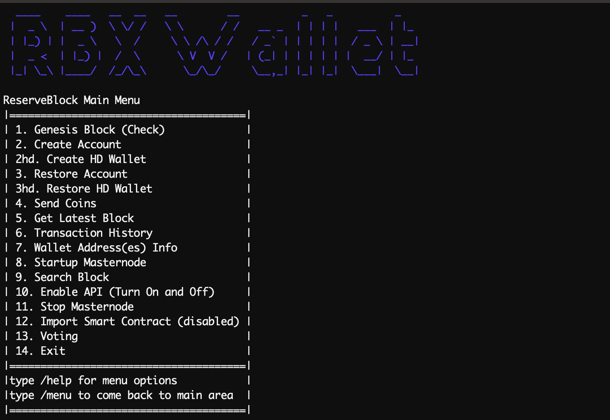

# CLI Overview

### The Command Line Interface

Use the CLI on Windows, MacOS, or Linux to interact with the network.

1. [Remote Setup](./cli-remote-setup)

2. [Build Instructions](./cli-build-instructions)

3. [Configuration](./cli-config)

4. [Beacons](./cli-beacons)

5. [Adjudicators](./cli-adjudicators)

