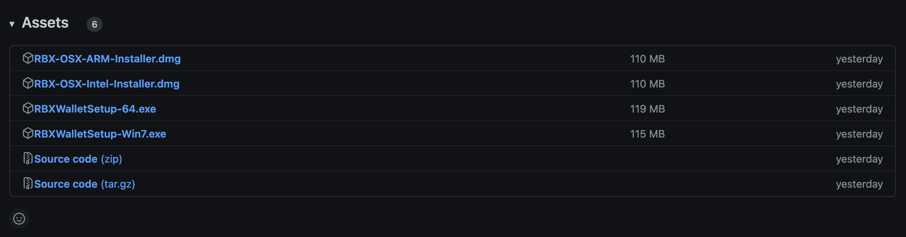

# GUI Download & Installation Instructions

This is the download and install instructions for the RBXWallet GUI.

## Video Tutorial

<iframe width="560" height="315" src="https://www.youtube.com/embed/QBhrBN0xhjE" title="YouTube video player" frameborder="0" allow="accelerometer; autoplay; clipboard-write; encrypted-media; gyroscope; picture-in-picture; web-share; fullscreen" allowfullscreen></iframe>

## Downloading

Visit this [Github Link](https://github.com/ReserveBlockIO/rbx-wallet-gui/releases/latest) to download the latest install files. Scroll to the bottom of the page and choose the appropriate file.

### Windows
> Download the file named `RBXWalletSetup-64.exe` for windows 8, 10, & 11. For Windows 7, download ` RBXWalletSetup-Win7.exe` 

### MacOS
> Download the file named `RBX-OSX-Intel-Installer.dmg` for Intel mac or `RBX-OSX-ARM-Installer.dmg` for ARM (M1/M2) Macs.

---

## Installing

Once downloaded (likely to your `Downloads` folder) you'll need to run the installer. The process is different between Windows and MacOS.

### Windows

1. Double click the installer file. If prompted with an `Unknown Publisher` window, click `Yes` or `Continue`. Note: this prompt varies depending on the version of your Windows. You may see a box that has a link reading `More Info`. If so, click that link to see a `Run Anyway` button. 

> If the installer doesn't launch at all, try right clicking on the icon and choose `Run as administrator`.

2. Follow the prompts by clicking `Next` followed by `Install`.

3. Once the progress bar finishes, you can click `Finish` to automatically run the wallet. 

4. For subsequent launches of the wallet, you will find an icon on your desktop, start menu, and it can be ran from the installed location (`C:\Program Files (x86)\RBXWallet\RBXWallet.exe`).

> If you are having trouble running it, try right clicking on the icon and choose `Run as administrator`.

### MacOS

1. Double click the installer file which will open a window in the bottom left corner of your screen.

2. Drag the `RBXWallet` application into the `Applications` folder in the window.

3. Right click on the `Shell` icon (`install`) and then click `Open`. This will launch the RBXWallet application.

4. For subsequent launches of the wallet, you can find it in your `/Applications` folder on your computer.

