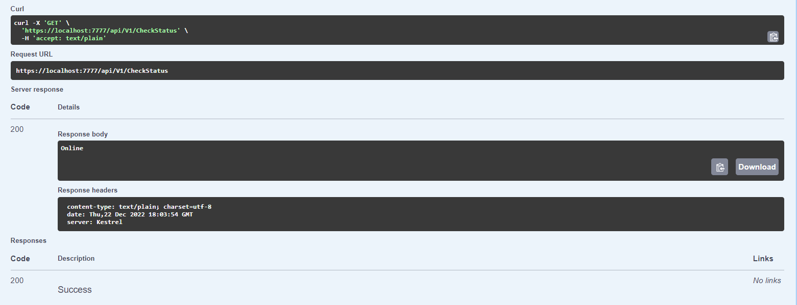

# VFX Integration Setup

## Summary

This document is intended to be used by all third-party integrators including, but not limited to, exchanges, third-party APIs, explorers, web tools/web wallets, and any other integrable products that the core CLI can connect to.

This document will outline the core CLI functions and give recommended practices. Please note that you should always follow the highest levels of security based on your own environment. This document is merely a guide to get you up and running.


## Wallet Information

Currently VFX has both a GUI and CLI wallet. These wallets will run in all environments **(windows, linux, and mac)**.
The VFX Core was built with **.Net 6 and C#.**
The VFX GUI was built with **Flutter/Dart**

> .Net 6 can be found here: <https://dotnet.microsoft.com/en-us/download/dotnet/6.0>

> The recommended IDE for VFX is Visual Studio 2022, or Visual Code.

> It is recommended for production level environments to run the CLI and communicate through the API. For personal use the GUI wallet is more than suitable.

**You can find pre-compiled binaries here:**  
CLI - <https://github.com/VerifiedXBlockchain/VerifiedX-Core/releases>  
GUI - <https://github.com/VerifiedXBlockchain/VerifiedX-GUI/releases>

If you are wanting to build from source, please choose the correct repo from here:
**https://github.com/ReserveBlockIO**

VFX wallet generates addresses based on the ECDSA curve.

Mainnet addresses start with an `R`.
Testnet addresses start with an `x`.

For the VFX P2P Layer, the wallet is using SignalR. More information on SignalR can be found here: **https://dotnet.microsoft.com/en-us/apps/aspnet/signalr**

For Beacons and Asset transfer the wallet is using its own modified version of a TCP listener with a socket handler. This allows the two functions to work together but not interfere with each at the same time.

The wallet is a multi-threaded application. Normal performance has been consistent with 2 CPU Cores - 2GB of ram. Any less than the recommended could result in slowed performance. An ideal setup is 3+ CPU Cores and 4 GB of ram. Your operating system will also determine this. As an example, Windows needing more resources you might want more, however a Linux with no GUI will require less.

The wallet main connection port 3338 must be configured to at least allow outgoing. If you do not want people connecting to you simply do not open that port for any incoming connections.

## Compile your own CLI

If you are wanting to compile your own CLI from source here is how to do this.  
The instructions below can be found here: [Build Instructions](/docs/core/build-instructions)

### Linux

inux Install For Ubuntu 22.04:

1. `sudo apt-get update && sudo apt-get install -y dotnet-sdk-6.0`
2. `sudo apt-get update && sudo apt-get install -y aspnetcore-runtime-6.0`
3. run `dotnet --version`. You should see a version number of 6.0.xxx
4. `mkdir rbx` - Makes a direction for RBX
5. cd rbx
6. - Clone the repo with git. `git clone https://github.com/VerifiedXBlockchain/VerifiedX-Core.git`
   - Download the already packaged release https://github.com/VerifiedXBlockchain/VerifiedX-Core/releases/. If you do this please navigate to the folder you downloaded binaries from and skip to step 12.
7. `cd VerifiedX-Core`
8. `dotnet build` - There should be 0 (zero) errors.
9. `dotnet publish -c Release -r linux-x64 --output ./rbxpublished`
   > Please note the `linux-x64` can be changed if you are on a different architecture like arm or x86.
10. `cd rbxpublished`
11. `dotnet ReserveBlockCore.dll`

From here you are done. The wallet will be running. To turn on the API simple type ‘10’ and press enter or you can pass it in as a command argument.

`dotnet ReserveBlockCore.dll enableapi`

You are done! You should now see a wallet running! Some common errors are usually related to file permissions. Please ensure you have given proper permission to the newly created RBX folder

### Windows

1. Install the latest dotnet sdk from here: **https://dotnet.microsoft.com/en-us/download/dotnet/6.0** Once that is installed follow steps below.

2. Create a directory for RBX and then open command prompt in admin and navigate to that directory.
3. Please ensure you have a working version of git installed.
4. - Clone the repo with git. `git clone https://github.com/VerifiedXBlockchain/VerifiedX-Core.git`
   - Download the already packaged release https://github.com/VerifiedXBlockchain/VerifiedX-Core/releases/. If you do this please navigate to the folder you downloaded binaries from and skip to step 8.
5. `cd VerifiedX-Core`
6. `dotnet build` - There should be 0 (zero) errors.
7. `dotnet publish -c Release -r win-x64 --output ./rbxpublished`
   > please note the `win-x64` can be changed if you are on a different architecture
8. `cd rbxpublished`
9. `dotnet ReserveBlockCore.exe`

### Mac OS X

1. Install the latest dotnet sdk from here: **https://dotnet.microsoft.com/en-us/download/dotnet/6.0** Once that is installed follow steps below.
2. Create a directory for RBX and then open command prompt in admin and navigate to that directory.
3. Please ensure you have a working version of git installed.
4. - Clone the repo with git. `git clone https://github.com/VerifiedXBlockchain/VerifiedX-Core.git`
   - Download the already packaged release **https://github.com/VerifiedXBlockchain/VerifiedX-Core/releases/**. If you do this please navigate to the folder you downloaded binaries from and skip to step 8.
5. `cd VerifiedX-Core`
6. `dotnet build` - There should be 0 (zero) errors.
7. `dotnet publish -c Release -r osx-x64 --output ./rbxpublished`
   > please note the 'osx-x64' can be changed if you are on a different architecture like arm.
8. `cd rbxpublished`
9. `dotnet ReserveBlockCore`, sometimes dotnet ReserveBlockCore.dll. Just depends on the current environment setup.

## Wallet Config Setup

### Summary

The point of this paper is to outline the config file setup and features it has.

1. Port (default is 3338)

   - Type `int`
   - Ex: `Port=3338.`
   - This is the port for all p2p functions. This should remain as 3338.

2. APIPort (default is 7292)

   - Type `int`
   - Ex: `APIPort=7292`
   - This is the port to call the API. This may be changed to whatever you want.

3. WalletPassword (default is null)

   - Type `string`
   - Ex: `WalletPassword=SomePassword1234!`
   - This is a password that will lock all functions in wallet and require you input a password to unlock wallet functions.

4. AlwaysRequireWalletPassword (default is false)

   - Type `boolean`
   - Ex: `AlwaysRequireWalletPassword=true`
   - If set to true you will be required to input password before every function call.

5. APIPassword (default is null)

   - Type `string`
   - Ex: `APIPassword=SomePassword1234!`
   - This is a password set to lock down control of the API. This password must be inputted to call any API function.
   - You will need to call UnlockWallet to unlock the API with this password.

6. AlwaysRequireAPIPassword (default is false)

   - Type `boolean`
   - Ex: `AlwaysRequireAPIPassword=true`
   - If set to true then you must include the password in all API request.

7. APICallURL (default is null)

   - Type `string`
   - Ex: `APICallURL=https://mycallbackurl.com`
   - This URL is used to send incoming transactions to an outside URL. This is something used for like incoming deposits or other notification. services.

8. WalletUnlockTime (default is 15)

   - Type `int`
   - Ex: `WalletUnlockTime=5`
   - This is the amount of time once a password has been entered the wallet will remain unlocked and not need password again. If any of the RequirePasswords above are set to true, then it will override this setting and require the password everytime.

9. ChainCheckPoint (default is false)

   - Type `Boolean`
   - Ex: ChainCheckPoint=true
   - This is a feature that will turn on chain check points. What this will do is create a FULL copy of the chains state and back it up and create a checkpoint you can revert back to in the event your current structure becomes corrupted.

10. ChainCheckPointInterval (default is 12)

    - Type `int`
    - Ex: `ChainCheckPointInterval=4`
    - This interval is in hours and means it will run the checkpoint every X amount of hours with 1 being the smallest allowed.

11. ChainCheckPointRetain (default is 2)

    - Type `int`
    - Ex: `ChainCheckPointRetain=4`
    - Retain is what will determine how many backups to keep before it will begin to remove the oldest backup to make room for new one.

12. ChainCheckPointLocation (default is default path)

    - Type `string`
    - Ex: `ChainCheckPointLocation=C:\somelocation\otherthan\default\`
    - If the default path is not wanted you can setup a new location for them to go to.

13. APICallURLLogging (default is false)

    - Type `Boolean`
    - Ex: `APICallURLLogging=true`
    - This will debug the API call URL in the event there is an issue with TX’s being sent to your URL. This is recommended to be turned on during the initial testing of your URL.

14. ValidatorAddress (default is null)

    - Type `string`
    - Ex: `ValidatorAddress=RBcHyS2AF4Z4jgzTLZNBVLvtxQ6MtB2vUN`
    - You can input a default validator address to instantly start validating. Please note you must also import the wallet address through the launch commands. Ex: ReserveBlockCore.exe privKey=MyPrivateKey.

15. ValidatorName (default is new guid)

    - Type `string`
    - Ex: `ValidatorName=MyValidatorRBX1`
    - This is the name for the above validator that will be used. Once validator has been imported once then these settings won’t do anything and can be removed or left there.

16. NFTTimeout (default is 15 secs)

    - Type `int`
    - Ex: `NFTTimeout=5`
    - This will control the timeout for processing an incoming NFT

17. PasswordClearTime (default is 10 mins)

    - Type `int`
    - Ex: `PasswordClearTime=5`
    - This will control the clear time for an ecrypted wallets password

18. AutoDownloadNFTAsset (default is true)
    - Type `Boolean`
    - Ex: `AutoDownloadNFTAsset=false`
    - This will control whether or not an NFT's asset is automatically downloaded
19. IgnoreIncomingNFTs (default is false)

    - Type `Boolean`
    - Ex: `IgnoreIncomingNFTs=false`
    - This will control whether or not incoming NFTs are processed or just added as a TX record

20. RejectAssetExtensionTypes (default is a List of rejected assets)

    - Type `List of string`
    - Ex: `RejectAssetExtensionTypes=exe,zip,pdf...` (ensure there are no spaces between types)
      --This will add extension types to the already defined list and will reject any NFT assets with these known extension types

21. AllowedExtensionsTypes (default is null)
    - Type `List of string`
    - Ex: `AllowedExtensionsTypes=pdf,doc,xls`
    - This will remove extension types to the already defined list and will allow any NFT assets with these known extension types to be downloaded

An example config setup could appear like this:


> This information is updated whenever new features are added and can be found here:
> **https://github.com/VerifiedXBlockchain/VerifiedX-Core/blob/main/ConfigSetup.md**

## RPC Interface Connection

#### Mainnet : http://localhost:7292/

#### TestNet: http://localhost:17292/

> The ports above can be changed in the config document.

The config setting is APIPort=[Insert new Port number, no brackets]

Example: APIPort=1337

The default ports are:

Mainnet : 7292
Testnet : 17292

There are five total API endpoints in the core CLI. They are as follows:

1. Beacons - /bcapi/BCV1
2. Smart Contracts - /scapi/SCV1
3. Transactions - /txapi/TXV1
4. General - /api/V1
5. Voting - /voapi/VOV1

## RPC Interface Config

Before interfacing with RPC You will want to ensure you have the config settings you desire.

The main config options are the following:

1. APIPort
   - Changes default API port to something else
   - `APIPort=1337`
2. APIPassword
   - Creates an API password to access all endpoints. Password is stored for 15 minutes or whatever is specified in WalletUnlockTime
   - `APIPassword=SomePassword123!`
3. AlwaysRequireAPIPassword
   - This makes the password required for every call regardless of WalletUnlockTime
   - `AlwaysRequireAPIPassword=true`
4. APICallURL
   - This is a custom URL that whenever a transaction is received will be called to deliver this information
   - `APICallURL=http://somecustomurl.com/api/`
5. WalletUnlockTime
   - Sets the time a password will keep the wallet unlocked when entered in minutes
   - `WaleltUnlockTime=5`

## RPC Interface

The RBX Core CLI uses a json based interface. You will want to create some type of Http client request and send “application/json” to the interface. From there you will want to await a result (post) from the client.

The best way to test the interface is to use Swagger.

The swagger location can be found here:

Mainnet: http://localhost:7292/swagger/index.html
Testnet: http://localhost:17292/swagger/index.html
Each API Endpoint has a list of methods with a description. Some of the most commonly used endpoints are as follows:

```
/api/V1/
    CheckStatus
    CheckPasswordNeeded
    GetIsWalletEncrypted
    GetIsEncryptedPasswordStored
    GetEncryptWallet/{password}
    GetDecryptWallet/{password}
    GetEncryptLock
    GetCLIVersion
    GetWalletInfo
    GetAllAddresses
    GetValidatorAddresses
    getgenesisblock
    ImportPrivateKey
    GetNewAddress
    SendTransaction/{from}/{to}/{amount}
    StartValidating/{address}/{username}
    TurnOnValidator/{id}
    TurnOffValidator/{id}
    GetValidatorInfo/{address}
    SendBlock/{height}
    GetMasternodes
    GetPeerInfo
    GetDebugInfo
    GetRollbackBlocks/{id}
    SendExit
    ClearRBXLog
    ChangeValidatorName/{name}

===================

/voapi/VOV1/
    GetAllTopics
    GetActiveTopics
    GetInactiveTopics
    GetMyTopics
    GetSearchTopics/{search}

    GetTopicDetails/{topicUid}
    GetMyVotes
    GetTopicVotes/{topicUid}
    CastTopicVote/{topicUid}/{vote}

===================

/scapi/scv1/
    GetAllSmartContracts
    GetAllSmartContracts/{page}/{search}
    GetMintedSmartContracts/{page}/{search}
    GetSingleSmartContract/{id}
    ChangeNFTPublicState/{id}
    GetSmartContractData/{id}
    CreateSmartContract
    MintSmartContract/{id}
    TransferNFT/{id}/{address}
    TransferNFT/{id}/{address}/{url}
    EvolveSpecific/{id}/{address}/{stage}
    Burn/{id}
    AssociateNFTAsset/{id}/{path}
    DownloadNftAssets/{id}
    GetNFTAssetLocation/{id}/{filename}


===================

/bcapi/BCV1/
    GetBeacons
    AddBeacon/{name}/{port}/{ip}
    CreateBeacon/{name}/{port}
    DeleteBeacon/{id}

====

/txapi/txV1/
    CreateAdnr/{address}/{name}
    TransferAdnr/{from}/{to}/
    DeleteAdnr/{address}
```

### Example

A short example would be as followed (C#)

```csharp
HttpClient client = new HttpClient();
string json = JsonConvert.SerializeObject(mainSc).Dump();
var httpContent = new StringContent(json, Encoding.UTF8, "application/json");
var httpResponse = await client.PostAsync("http://localhost:7292/api/V1/CheckStatus", httpContent);

var responseString = await httpResponse.Content.ReadAsStringAsync();
```

This results in the following: a response body of `Online`


The curl example is as follows:

```
curl -X 'GET' \
  'http://localhost:7292/api/V1/CheckStatus' \
  -H 'accept: text/plain'
```

Another basic example in Go is a follows:

```go
package main

import (
    "fmt"
    "net/http"
    "io/ioutil"
    "os"
    )

func main() {
    response, err := http.Get("http://localhost:7292/api/v1/CheckStatus")
    if err != nil {
        fmt.Printf("%s", err)
        os.Exit(1)
    } else {
        defer response.Body.Close()
        contents, err := ioutil.ReadAll(response.Body)
        if err != nil {
            fmt.Printf("%s", err)
            os.Exit(1)
        }
        fmt.Printf("%s\n", string(contents))
    }
}
```

## Testnet Information

Testnet Information
Testnet can be activated two ways:

1. Passing in testnet as an argument when starting a wallet.
   - Ex: `reserveblockcore.exe testnet`
2. Enabling it in the config.
   - Ex: `TestNet=true`


Please be sure you are on testnet so as to not make any mistakes with your mainnet accounts.
VFX addresses on testnet will ALWAYS start with an `x`. For Example:
`xC1zNn7596TC4Bcyn1vE88pj12hfieqCoa`

The primary testnet faucet will come from this address (subject to change): `xMpa8DxDLdC9SQPcAFBc2vqwyPsoFtrWyC`

There are three ways to get funds from the faucet:

1. Message the discord channel titled `Testnet Faucet` with your VFX address and funds will be sent.
2. Reach out to your point of contact through your current chat tool (telegram, skype, email, etc.) and ask them to send funds to a request testnet address.
3. Use the testnet faucet via the explorer (https://spyglass-testnet.verifiedx.io/faucet)

It is advised to begin with testnet to ensure all functions are working with your environment before moving over to mainnet.

## The CLI


The VFX CLI is recommended for most enterprise or third-party integrators as it runs headless and the most efficiently.

The CLI is still rather robust and the main menu options are seen above, and more options can be discovered by typing /help and pressing enter.

For example:

Once a CLI is started you may type commands at any point and time and interact with the wallet and not need to worry about stopping any of the background processes. Closing the wallet is the only thing to stop all functions.

The wallet must be left open for items to continue running. If using Linux and SSH it is recommended to use screen or other tool to keep it running.

Screen example:
screen dotnet ReserveBlockCore.dll

> `ctrl A & ctrl D`
> to detach from the screen session.

> when returning to return you type `screen -r` and press enter.

## Third Party Interfacing for Exchanges and other Entities

### Summary

This section will outline the best practices for setting up an VFX wallet in your environment. While many of these features are optional it is recommended to leverage as many, if not all, as you can.

The section will cover the config.txt setup, password setup, and how to use the API in some common and general scenarios that will fit most environments.

The VFX Architecture very closely follows the philosophies and principles of Bitcoin so integration will also very similarly mimic that. This was done by design to ease the burden of the solution and the fact it is a layer 1.

### Build the Project

Depending on your environment you will find build instructions for Windows, Linux, and Mac here: **https://github.com/VerifiedXBlockchain/VerifiedX-Core/blob/main/RBXBuildInstructions.md**

Follow the instructions and you can either build the project from source to ensure you are receiving a clean version of the program, or you can build from a binary posted in the release section here: **https://github.com/VerifiedXBlockchain/VerifiedX-Core/releases**

### Configuration File Setup (Config.txt)

A full list of configuration options can be seen here: **https://github.com/VerifiedXBlockchain/VerifiedX-Core/blob/main/ConfigSetup.md**

First you want to start up the wallet to generate a stock configuration file. Depending on your environment it will be located in the same folder the database folder is.

First thing is to change the APIPort and set an APIPassword. You can choose to require the API password always, or if you don’t the API is set to stay unlocked for 15 minutes by default. You can change that with the WalletUnlockTime command.

You can also configure a wallet password here as well if you plan to feed commands directly into the CLI. An example could look like this:


These are the most relevant config options:

1. Port (default is 3338)

   - Type int
   - Ex: `Port=3338.`
   - This is the port for all p2p functions. This should remain as 3338.

2. APIPort (default is 7292)

   - Type int
   - Ex: `APIPort=7292`
   - This is the port to call the API. This may be changed to whatever you want.

3. WalletPassword (default is null)

   - Type string
   - Ex: `WalletPassword=SomePassword1234!`
   - This is a password that will lock all functions in the wallet and require you input a password to unlock wallet functions.

4. AlwaysRequireWalletPassword (default is false)

   - Type boolean
   - Ex: `AlwaysRequireWalletPassword=true`
   - If set to true you will be required to input a password before every function call.

5. APIPassword (default is null)

   - Type string
   - Ex: `APIPassword=SomePassword1234!`
   - This is a password set to lock down control of the API. This password must be inputted to call any API function.

6. AlwaysRequireAPIPassword (default is false)

   - Type boolean
   - Ex: `AlwaysRequireAPIPassword=true`
   - If set to true then you must include the password in all API request.

7. APICallURL (default is null)

   - Type string
   - Ex: `APICallURL=https://mycallbackurl.com`
   - This URL is used to send incoming transactions to an outside URL. This is something used for incoming deposits or other notifications. services.

8. WalletUnlockTime (default is 15)

   - Type int
   - Ex: `WalletUnlockTime=5`
   - This is the amount of time once a password has been entered the wallet will remain unlocked and not need a password again. If any of the RequirePasswords above are set to true, then it will override this setting and require the password every time.

## Optional APICallURL

You can also set up an APICallURL. This will be a URL you input that the VFX wallet upon receiving any new incoming transaction the wallet will call out to this URL sending a json response following the transaction model. This will allow you to easily get incoming transactions in real time and immediately.

## Setting Up Wallet & Private Key Encryption

You can set up a wallet simply by opening the VFX wallet. From there you can generate an infinite number of addresses or set up a 24 word mnemonic to create an HD wallet.

Recommend you backup your phrase offline or create it in an air gapped environment.
It is strongly recommended you encrypt your private keys. This will protect you if your database files are stolen they will not be able to access funds as the private keys will be encrypted.
To encrypt your private keys simply call the /encrypt in the wallet and follow the instructions. It will have you type in a password twice, to ensure it is correct. 1000 addresses will be auto generated at the start. Should more be needed, that is fine.

The only time you need to type a password in is when you want to do something with a private key. The two main functions are sending a transaction or signing a message. This process is very similar to Bitcoin and if you are already doing this then you won’t feel any difference.
When you type in your password it is stored as a SecureString for 10 minutes, unless specified otherwise. After 10 minutes Garbage collection is called and it is both cleared from the application as well as the system RAM.

## General Use

rom here how you integrate to your application or systems is dependent on your current environment. The Swagger endpoint has all the APIs needed for integrating and all use cases. If you are an exchange one possible route is to do the following:

1. Generate all your deposit addresses
2. Store the addresses in memory in a list.
3. Every 30-60 seconds perform a check
   - Check each new block against the list stored in step 2 and see if any incoming transactions exist. If so then you have a new deposit
   - Keep a list of all TX hashes and then run a scan against the last time checked with a timestamp and if any next hashes exist that you don’t have stored then you also know you have a new deposit.
4. Credit the account associated with the deposit address.
5. For withdrawals simply verify funds against your own DB and execute a SendTransaction/ API call.

The above example is a simple use case for processing incoming deposits. If your environment has any special needs they obviously would be added in, but the above model does work.

You can attempt to use the APICallURL which will send a new TX everytime one is detected, but only from a deposit perspective as a withdrawal would not make sense.

If you have any needs or specific questions it's recommended to reach out over discord or the current chat tool you are using like telegram, skype, email, etc.

## Conclusion

This document will get most integrations started in the right direction, however, please don’t hesitate to reach out to the VFX community and devs through discord or if you are currently talking to anyone through other social channels please reach out to them there with any questions.

